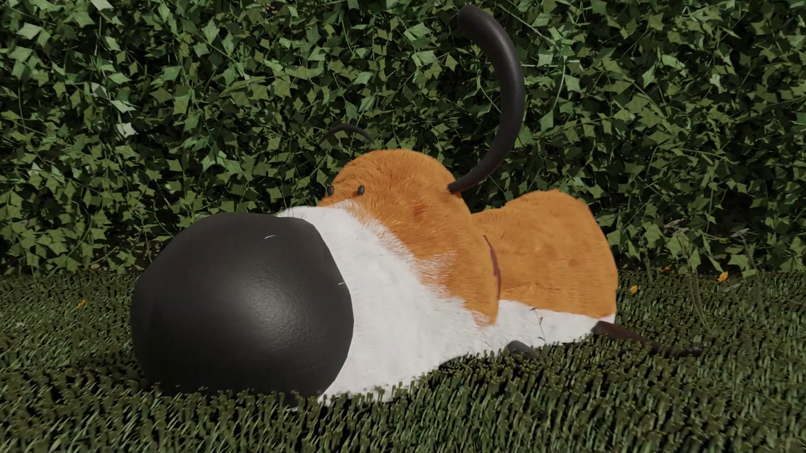

# Projects Overview

These two projects are centered around a common software: Blender. They provided us with the opportunity to apply our knowledge in animation and 3D modeling.

## Project 1: 3D Modeling

The 3D modeling project was developed in Blender, showcasing a visual scene set inside a church, illuminated by light coming from the windows and candles. The focal point is the altar, where dragon claws and an egg are positioned. All elements in the scene were modeled by us, utilizing various techniques.

### Key Features:
- **Dragon Egg Design**: The dragon egg was created using advanced geometry nodes, allowing for intricate designs.
- **Particle System**: A particle system simulating lava adds dynamic visual effects, creating an engaging contrast against the dark surroundings.

## Project 2: Animation

CGI reproduction of "The Postman" ad spot (https://youtu.be/AfsxkcfZ6Oo?si=iHOLg7a5Z78WJUo4) produced in Blender, with techniques like: 
- Modeling
- Rigging 
- Animation of scenes with the usage of modern animation techniques

## Credits
This game was created by:
- Alberto Cagnazzo
- Giulio Arecco
- Erika Astegiano
